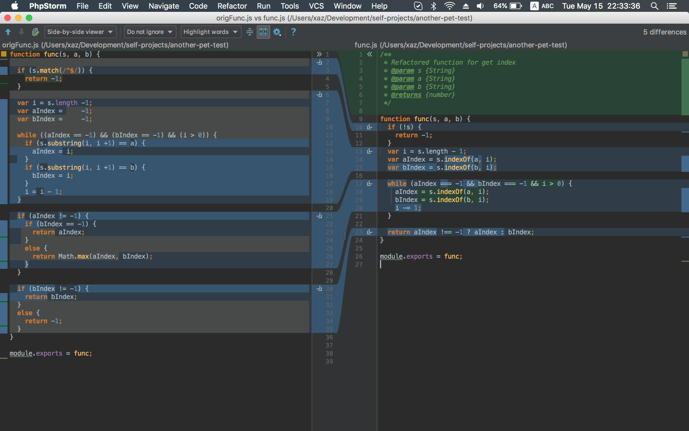

# Work with strange code

### Run
```
$ npm install
$ npm test
```

## Comparing



#### Что можно улучшить
1. Сделать поиск подстроки в моменте объявления переменных, если мы находим a или b в конце строки, то мы не заходим в while, так как `aIndex`  или `bIndex` не будут равны -1. 
2. Сделать однострочный `return` для читаемости
3. Отказаться от match и регулярки, так как функция может крашнутся если `typeof s !== 'string'`, правда конструкция вида `if(!s)` может сказаться на производительсности, но так как в коде я не использую ES6 с его дефолтными значениями, то думаю это простительно
4. Форматирование, jsdoc, индентация в соответствии `.editorconfig` или по дефолту IDE
5. Сделать `===` везде, дабы не попасть на уловки приведения типов  
